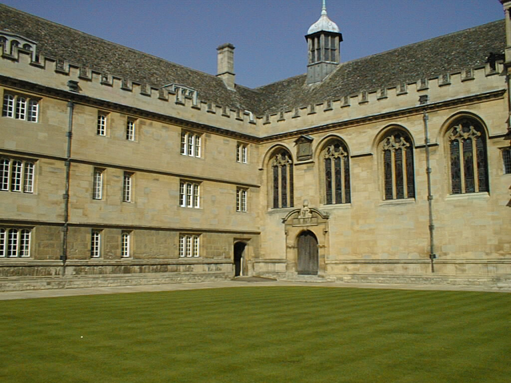

# 3D-Reconstruction-with-Plane-Homography-Constraint
3D Reconstruction and Plane Segmentation under Manhattan World Assumption, which consists of three main orthogonal planes.
Given two image from different perspective, without any calibation parameter, reconstruct the scene up to scale.

## Pipiline

## Inputs
 

## Results

## How to Run
### Prerequisites
MATLAB 2018 or Higher
### 3D reconstruction
Run
./code/test3DReconstruction.m

### Vanishing Points Detection and adjustment
Run
./code/testVP.m

